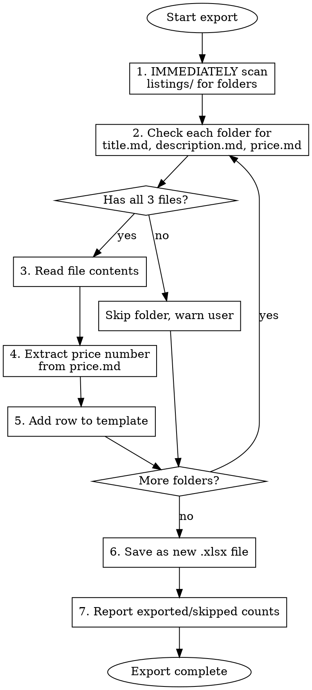

# Export to FB Marketplace Bulk Upload Template

Every listing we export follows this exact workflow. We never skip steps or guess at column mappings.

## Requirements

Before proceeding, you MUST:

1. Verify the `listings/` directory exists and contains subdirectories
2. Confirm each folder has all three files: `title.md`, `description.md`, `price.md`
3. Use Python with openpyxl - no other libraries or manual Excel creation
4. Always save with a timestamped filename - never overwrite previous exports

Folders missing ANY required file MUST be skipped with an explicit warning to the user.

## Workflow



## Template Format

Our output Excel file MUST match the FB Marketplace Bulk Upload Template exactly:

| Row | Content |
|-----|---------|
| 1 | "Facebook Marketplace Bulk Upload Template" |
| 2 | Instructions text |
| 3 | Column requirements (REQUIRED/OPTIONAL) |
| 4 | Headers: TITLE, PRICE, CONDITION, DESCRIPTION, CATEGORY, OFFER SHIPPING |
| 5+ | Listing data |

## Column Mapping

Every export follows this exact mapping - no exceptions:

| Column | Source | Rules |
|--------|--------|-------|
| TITLE | `title.md` | First line only, truncate at 150 chars |
| PRICE | `price.md` | Always extract numeric value, always integer |
| CONDITION | Default | Always "Used - Good" unless explicitly overridden |
| DESCRIPTION | `description.md` | Full content, truncate at 5000 chars |
| CATEGORY | Empty | Always leave empty - FB auto-categorizes |
| OFFER SHIPPING | Default | Always "No" - we do local pickup only |

## Price Extraction

Always extract the numeric price using this logic:

- `$15` → 15
- `$25-30` → 25 (always use lower bound for ranges)
- `15` → 15
- `$15.00` → 15 (always convert to integer)

Never leave price as a string. Never include the dollar sign in the Excel cell.

## Implementation

Always use this exact Python implementation with openpyxl:

```python
import openpyxl
from pathlib import Path
import re

def export_listings_to_template(listings_dir: Path, output_path: Path):
    wb = openpyxl.Workbook()
    ws = wb.active

    # Header rows - MUST match FB template exactly
    ws['A1'] = 'Facebook Marketplace Bulk Upload Template'
    ws['A2'] = 'You can create up to 50 listings at once. When you are finished, be sure to save or export this as an XLS/XLSX file.'
    ws['A3'] = 'REQUIRED | Plain text (up to 150 characters'
    ws['B3'] = 'REQUIRED | A whole number in $'
    ws['C3'] = 'REQUIRED | Supported values: "New"; "Used - Like New"; "Used - Good"; "Used - Fair"'
    ws['D3'] = 'OPTIONAL | Plain text (up to 5000 characters'
    ws['E3'] = 'OPTIONAL | Type of listing'
    ws['F3'] = 'OPTIONAL | '
    ws['A4'] = 'TITLE'
    ws['B4'] = 'PRICE'
    ws['C4'] = 'CONDITION'
    ws['D4'] = 'DESCRIPTION'
    ws['E4'] = 'CATEGORY'
    ws['F4'] = 'OFFER SHIPPING'

    row = 5
    for folder in sorted(listings_dir.iterdir()):
        if not folder.is_dir() or folder.name.startswith('.'):
            continue

        title_file = folder / 'title.md'
        desc_file = folder / 'description.md'
        price_file = folder / 'price.md'

        if not all(f.exists() for f in [title_file, desc_file, price_file]):
            print(f"Skipping {folder.name}: missing required files")
            continue

        title = title_file.read_text().strip().split('\n')[0][:150]
        description = desc_file.read_text().strip()[:5000]
        price_text = price_file.read_text().strip()

        # Extract numeric price - ALWAYS integer
        match = re.search(r'\$?(\d+)', price_text)
        price = int(match.group(1)) if match else 0

        ws[f'A{row}'] = title
        ws[f'B{row}'] = price
        ws[f'C{row}'] = 'Used - Good'
        ws[f'D{row}'] = description
        ws[f'E{row}'] = ''
        ws[f'F{row}'] = 'No'
        row += 1

    wb.save(output_path)
    return row - 5  # Return count of exported listings
```

## Output

Always save the template file as:
```
listings/Marketplace_Export_[YYYY-MM-DD].xlsx
```

Never overwrite previous exports. The timestamp ensures we keep a history of our exports.

## Execution Checklist

Complete every step in order - never skip ahead:

1. IMMEDIATELY scan `listings/` directory for all subdirectories
2. For each folder, verify all three files exist before reading
3. Read and parse each file
4. Extract numeric price value (always integer)
5. Add row to Excel with our exact column mapping
6. Save with timestamped filename
7. ALWAYS report final counts: X listings exported, Y skipped

## Common Mistakes

| Mistake | Result | Fix |
|---------|--------|-----|
| Including template file in export | Corrupted output, FB rejects upload | Always skip files starting with "Marketplace_" |
| Leaving price as string | FB rejects the listing | Always convert to integer with regex extraction |
| Truncating without warning | User unaware of data loss | Always warn if title > 150 or description > 5000 chars |
| Skipping the final report | User doesn't know what happened | Always report "X exported, Y skipped" when done |
| Including hidden folders | Garbage rows in output | Always skip folders starting with "." |
| Overwriting previous export | Lost export history | Always use timestamped filename |
