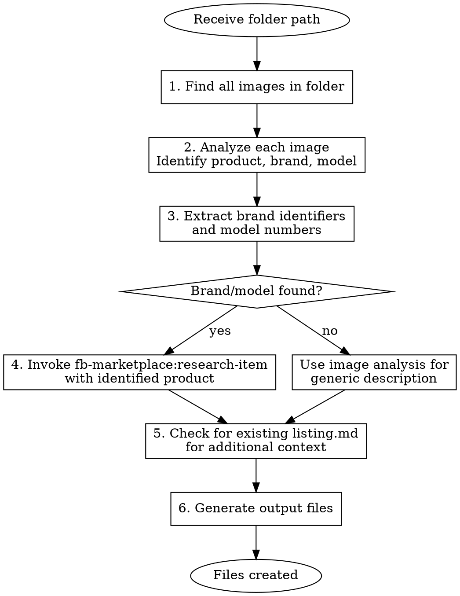

# Generate FB Marketplace Listing Summary

Every listing we create follows this exact workflow. We never skip steps or guess at product details.

## Requirements

Before proceeding, you MUST:

1. Have a folder path in the `listings/` directory containing product images
2. Commit to analyzing ALL images - not just the first one
3. Invoke `fb-marketplace:research-item` whenever brand/model is identified - no exceptions

## Workflow



## Steps

### 1. Find All Images

IMMEDIATELY scan the provided folder for image files. Never assume what's there.

Supported formats - check for all of these:

- `.jpeg`, `.jpg`, `.png`, `.heic`, `.webp`

### 2. Analyze Images

Use the Read tool to view EVERY image. For each image, you MUST identify:

- **What is the product?** (category, type)
- **Condition**: New, like new, good, fair
- **Quantity**: Single item or multiple
- **Visible brand names or logos**
- **Model numbers, serial numbers, or product codes**
- **Size indicators** (if visible)

Never stop at the first image - critical information appears on backs, bottoms, and tags.

### 3. Extract Brand/Model Information

You MUST look for:

- Brand name on product or packaging
- Model number (often on stickers, tags, or embossed)
- UPC/barcode numbers
- Any text that identifies the specific product

**Always check these locations:**

- Front label/logo
- Bottom or back of product
- Tags on clothing/shoes
- Stickers on electronics
- Embossed text on tools

### 4. Research Product

**If brand/model is identified - this is mandatory:**

```
Invoke skill: fb-marketplace:research-item
Input: Brand name, model number, product category
```

Never skip research when we have a brand. Research transforms guesses into accurate listings.

**If no brand/model found:**

- Use generic product description from image analysis
- Estimate pricing based on similar items
- Note "Unbranded" or "Generic" in listing

### 5. Check Existing listing.md

IMMEDIATELY check if a `listing.md` file exists in the folder:

- Read it for additional context (sizes, quantities, notes)
- Incorporate this information into our output

Never ignore seller notes - they contain information invisible in photos.

### 6. Generate Output Files

Create three files in the listing folder. Every file MUST follow these exact formats:

#### title.md

```markdown
[Concise, searchable title - max 100 chars]
[Brand] [Product Type] [Key Feature/Size] - [Condition]
```

**Our title formula - follow exactly:**

- Lead with brand (if known)
- Include product type
- Add distinguishing feature (size, color, model)
- Keep under 100 characters
- Use title case

**Examples:**

- `Galanz ExpressWave 1100W Microwave - Inverter Technology`
- `3 Pairs Rubber Boots - Men's Sizes 9, 10, 13`
- `SKLZ Quick Ladder Agility Training Set - 15ft`

#### description.md

```markdown
[Detailed description for FB Marketplace]

## Product Details

[From research or image analysis]

## Condition

[Describe actual condition based on images]

## Includes

[List what's included]

## Specifications

[Dimensions, capacity, etc. if known]

## Pickup

Local pickup only in Chapel Hill off of Larkin Lane.
```

**Our description requirements:**

- Start with a hook (what it is, why it's great)
- Include specifications from research - never omit these
- Describe actual condition honestly
- List what's included
- Keep paragraphs short for mobile reading

#### price.md

```markdown
[Recommended price or price range]

## Pricing Rationale

- Retail: $XX
- Used market range: $XX - $XX
- Condition adjustment: [factor]
- Recommended: $XX
```

## Output File Locations

All files MUST be created in the same folder as the images:

```
listings/
  [Item Folder]/
    IMG_xxxx.jpeg     # Original images
    listing.md        # Optional: existing notes
    title.md          # Generated
    description.md    # Generated
    price.md          # Generated
```

## Example Execution

For folder `listings/Galanz ExpressWAve Microwave/`:

1. Find images: `IMG_8417.jpeg`, `IMG_8418.jpeg`, `IMG_8420.jpeg`
2. Analyze: Galanz ExpressWave microwave, stainless steel, 1100W inverter
3. Extract: Brand=Galanz, Model=ExpressWave, 1100W
4. Research: Invoke `fb-marketplace:research-item` with "Galanz ExpressWave 1100W microwave"
5. Check: No existing listing.md
6. Generate:
   - `title.md`: "Galanz ExpressWave 1100W Microwave - Inverter Technology - Excellent Condition"
   - `description.md`: Full description with specs from research
   - `price.md`: "$45-55" based on research showing $80-100 retail

## Common Mistakes

| Mistake | Result | Fix |
| ------- | ------ | --- |
| Analyzing only the first image | Missing brand info on back/bottom, incorrect identification | Always analyze ALL images in the folder |
| Skipping brand in images | Generic listing that undersells the product | Always check all angles, bottom, back, tags |
| Overly long titles | Gets truncated, looks unprofessional | Always keep under 100 chars, focus on searchable terms |
| Generic descriptions | Listing looks lazy, fewer buyers | Always invoke research-item and use specific features |
| Pricing without research | Items either never sell or leave money on the table | Always invoke research-item for accurate pricing |
| Ignoring listing.md | Missing seller context like sizes, quantities, defects | Always check for existing notes before generating |
| Skipping specifications | Buyers flood comments with questions | Always include dimensions and key specs from research |
