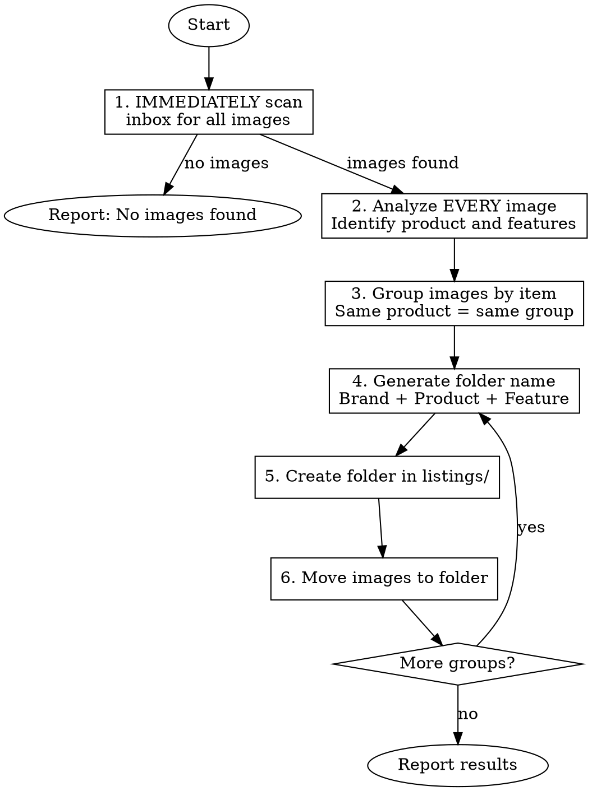

# Process Inbox Images

Every listing we create starts here. We transform raw photos in `inbox/` into organized listing folders in `listings/`, grouping images of the same item together based on visual analysis.

## Requirements

Before proceeding, you MUST:

1. Have images in the `inbox/` folder at the project root
2. Commit to analyzing ALL images before grouping - never assume from filenames
3. Create descriptive folder names that will work as listing titles

## Workflow



## Steps

### 1. Scan Inbox

IMMEDIATELY scan `inbox/` for all image files. Supported formats - check for all of these:

- `.jpeg`, `.jpg`, `.png`, `.heic`, `.webp`

If inbox is empty, report "No images found in inbox" and stop.

### 2. Analyze Each Image

Use the Read tool on EVERY image - no exceptions. For each image, you MUST identify:

- **Product type**: What is this? (tool, furniture, electronics, clothing)
- **Brand/model**: Visible brand names, logos, model numbers
- **Distinguishing features**: Color, size, condition, accessories
- **Scene context**: Background, surface, other items visible

Never stop at the first image. Critical grouping information appears across multiple photos.

**Grouping signals to look for:**

- Same product from different angles
- Same background/surface
- Sequential filenames (IMG_1234, IMG_1235)
- Matching brand/color

### 3. Group Images by Item

Create groups where each group represents ONE listing - no exceptions:

- Images showing the same product from different angles = ONE group
- Multiple of the same item type = ONE group (e.g., "3 pairs of boots")
- Unrelated items = SEPARATE groups

**Strong grouping signals (trust these):**
- Same exact product visible
- Same brand and model
- Same distinctive color/pattern

**Weak grouping signals (always verify with image content):**
- Sequential filenames
- Similar backgrounds

When unsure, prefer smaller groups. We can always merge listings later - splitting them is harder.

### 4. Generate Folder Names

Create descriptive folder names for each group. Our naming format - follow exactly:

**Format**: `[Brand] [Product Type] [Distinguishing Feature]`

**Rules - no exceptions:**
- Title case
- No special characters except hyphens and spaces
- Max 50 characters
- MUST be unique in listings/

**Examples:**
- `DeWalt Cordless Drill 20V`
- `Black Metal Outdoor Bench`
- `Vintage Radio Shack Electronics Kits`
- `Nike Running Shoes Size 10`

### 5. Create Folders and Move Images

For each group:

1. IMMEDIATELY create the folder in `listings/`
2. Move all grouped images from `inbox/` to the new folder

Always use `mv` to move files - never `cp`. Images MUST be removed from inbox after processing.

### 6. Report Results

After processing, ALWAYS report what we did:

```
Processed X images into Y listing folders:

1. [Folder Name] (N images)
   - IMG_xxxx.jpeg
   - IMG_xxxx.jpeg

2. [Folder Name] (N images)
   - IMG_xxxx.jpeg
```

Never skip the final report - the user needs to know what happened.

## Common Mistakes

| Mistake | Result | Fix |
|---------|--------|-----|
| Grouping by filename only | Unrelated items in same folder, ruined listings | Always analyze image content first |
| Analyzing only the first image | Miss grouping signals, wrong product identification | Always analyze ALL images before grouping |
| One image per folder | Multiple listings for same item, wasted effort | Always group same products together |
| Generic folder names | Hard to find listings later, poor listing titles | Always include brand and distinguishing features |
| Not checking existing folders | Duplicates in listings/, confusion | Always check if similar folder exists first |
| Copying instead of moving | Images remain in inbox, processed again | Always use mv, never cp |
| Skipping the final report | User doesn't know what happened | Always report "X images into Y folders" |

## Edge Cases

**Existing folder with same name**: Append a number (e.g., `DeWalt Drill 2`) or add a distinguishing feature. Never overwrite.

**Unidentifiable items**: Use descriptive names based on what's visible: `Blue Ceramic Vase`, `Vintage Metal Tool`. Never use generic names like "Item" or "Unknown".
