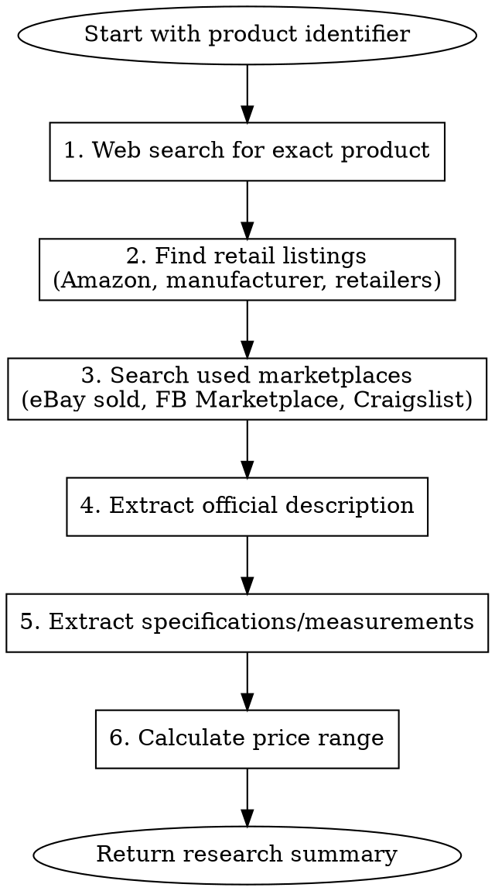

# Research Item for FB Marketplace

## Overview

Research a product online to gather pricing, descriptions, and specifications for creating accurate FB Marketplace listings.

## When to Use

- After identifying a brand name or model number from product images
- When you need to find the retail/used price of an item
- When you need official product descriptions or specifications
- When measurements or dimensions are needed for a listing

## Required Input

You must be provided with:

- **Product identifier**: Brand name, model number, or detailed product description
- **Product category**: (e.g., electronics, clothing, tools, furniture)

## Research Workflow



## Research Steps

### 1. Search for Exact Product

Use WebSearch to find the product:

- Search: `"[Brand] [Model]"` (exact match first)
- Search: `[Brand] [Model] specifications`
- Search: `[Brand] [Model] review`

### 2. Find Retail Price

Look for current retail pricing:

- Amazon product pages
- Manufacturer website
- Major retailers (Home Depot, Walmart, Target, etc.)

Record:

- Current retail price (or last known if discontinued)
- MSRP if different from current price

### 3. Find Used Market Value

Search for sold/completed listings:

- `[Brand] [Model] site:ebay.com sold`
- `[Brand] [Model] used price`
- Check FB Marketplace (if accessible) for similar items

Record:

- Price range of recently sold items
- Average selling price
- Condition notes that affect price

### 4. Extract Product Description

From official sources, extract:

- Official product name/title
- Key features (bullet points)
- Product category
- Target use case

### 5. Extract Specifications

Look for:

- **Dimensions**: Height, width, depth, weight
- **Capacity**: Volume, wattage, size ratings
- **Materials**: Construction materials
- **Model variants**: Color options, size options
- **Included accessories**: What comes in the box

### 6. Calculate Price Recommendation

| Condition               | Suggested Price  |
| ----------------------- | ---------------- |
| Like New / Sealed       | 60-75% of retail |
| Excellent (minimal use) | 50-60% of retail |
| Good (normal wear)      | 40-50% of retail |
| Fair (visible wear)     | 25-40% of retail |

Adjust based on:

- Local market demand
- Seasonality
- Completeness (all parts/accessories)
- Age of product

## Output Format

Return a structured summary:

```markdown
## Research Summary: [Product Name]

### Product Identification

- **Brand**: [Brand]
- **Model**: [Model Number]
- **Full Name**: [Official Product Name]

### Pricing

- **Retail Price**: $XX (source)
- **Used Market Range**: $XX - $XX
- **Recommended Listing Price**: $XX - $XX

### Description

[Official product description or synthesized description from research]

### Specifications

- Dimensions: [H x W x D]
- Weight: [Weight]
- [Other relevant specs]

### Key Features

- [Feature 1]
- [Feature 2]
- [Feature 3]

### Sources

- [URL 1]
- [URL 2]
```

## Common Mistakes

| Mistake                             | Fix                                         |
| ----------------------------------- | ------------------------------------------- |
| Using retail price as listing price | Always discount 40-75% for used items       |
| Missing model number in search      | Include exact model for accurate results    |
| Ignoring condition in pricing       | Adjust price based on actual item condition |
| Single source for pricing           | Check multiple sources for accurate range   |
