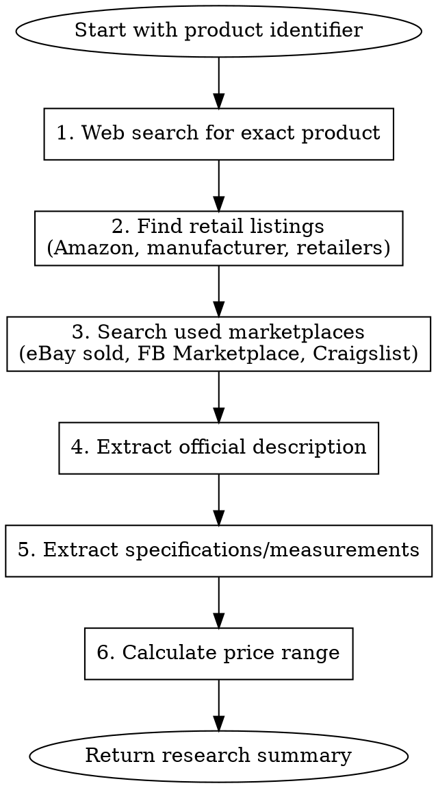

# Research Item for FB Marketplace

Every accurate FB Marketplace listing in our workflow starts here. We never guess prices or descriptions - we research them.

## Requirements

Before proceeding, you MUST:

1. Have a product identifier (brand name, model number, or detailed description)
2. Know the product category (electronics, clothing, tools, furniture, etc.)
3. Commit to checking multiple sources - single-source pricing always fails

## Research Workflow



## Tool Strategy

**Prefer WebSearch over WebFetch.** WebSearch returns rich summaries directly and is fast/reliable. WebFetch often hangs or fails on retailer sites (Costco, Amazon, etc.).

- **Use WebSearch**: For all pricing, specifications, and product info
- **Use WebFetch**: Only for manufacturer spec sheets or PDFs that WebSearch can't summarize
- **If WebFetch fails or hangs**: Move on immediately - use WebSearch results instead

**Run searches in parallel** when they don't depend on each other.

## Research Steps

### 1. Search for Product Info (Run in Parallel)

IMMEDIATELY run these WebSearch queries in parallel:

- `"[Brand] [Model]" specifications price` (primary search)
- `[Brand] [Model] site:ebay.com sold` (used market pricing)
- `[Brand] [Model] review` (features and real-world info)

### 2. Extract Pricing from Search Results

WebSearch results typically include prices directly. Look for:

- Retail prices from Amazon, Home Depot, Walmart, Costco in search snippets
- eBay sold prices in search results
- Do NOT use WebFetch on retailer sites - they block or hang

Record:

- Current retail price (or last known if discontinued)
- Used/sold price range from eBay results

### 3. Extract Product Description

From WebSearch results, extract:

- Official product name/title
- Key features (bullet points)
- Product category
- Target use case

Never write our own marketing copy when official descriptions exist.

### 4. Extract Specifications

Always look for these - missing specs make listings fail:

- **Dimensions**: Height, width, depth, weight
- **Capacity**: Volume, wattage, size ratings
- **Materials**: Construction materials
- **Model variants**: Color options, size options
- **Included accessories**: What comes in the box

### 5. Calculate Price Recommendation

We always use this pricing table - no exceptions:

| Condition               | Suggested Price  |
| ----------------------- | ---------------- |
| Like New / Sealed       | 60-75% of retail |
| Excellent (minimal use) | 50-60% of retail |
| Good (normal wear)      | 40-50% of retail |
| Fair (visible wear)     | 25-40% of retail |

You MUST adjust based on:

- Local market demand
- Seasonality
- Completeness (all parts/accessories)
- Age of product

## Output Format

Every research summary MUST follow this exact format:

```markdown
## Research Summary: [Product Name]

### Product Identification

- **Brand**: [Brand]
- **Model**: [Model Number]
- **Full Name**: [Official Product Name]

### Pricing

- **Retail Price**: $XX (source)
- **Used Market Range**: $XX - $XX
- **Recommended Listing Price**: $XX - $XX

### Description

[Official product description or synthesized description from research]

### Specifications

- Dimensions: [H x W x D]
- Weight: [Weight]
- [Other relevant specs]

### Key Features

- [Feature 1]
- [Feature 2]
- [Feature 3]

### Sources

- [URL 1]
- [URL 2]
```

## Common Mistakes

| Mistake                             | Result                                      | Fix                                                |
| ----------------------------------- | ------------------------------------------- | -------------------------------------------------- |
| Using WebFetch on retailer sites    | Hangs or fails, wastes time                 | Use WebSearch - it returns prices in snippets      |
| Using retail price as listing price | Item never sells, wastes seller's time      | Always discount 25%-30% for used items             |
| Missing model number in search      | Wrong product, wrong price, angry buyer     | Always include exact model for accurate results    |
| Ignoring condition in pricing       | Overpriced items sit unsold for weeks       | Always adjust price based on actual item condition |
| Single source for pricing           | Wildly inaccurate estimates                 | Always check multiple sources - minimum of 3       |
| Skipping specifications             | Buyers ask questions, listing looks amateur | Always extract dimensions and key specs            |
| Writing custom descriptions         | Inconsistent quality, missing features      | Always use official descriptions when available    |
| Running searches sequentially       | Slow research, user waiting                 | Run independent WebSearch queries in parallel      |
