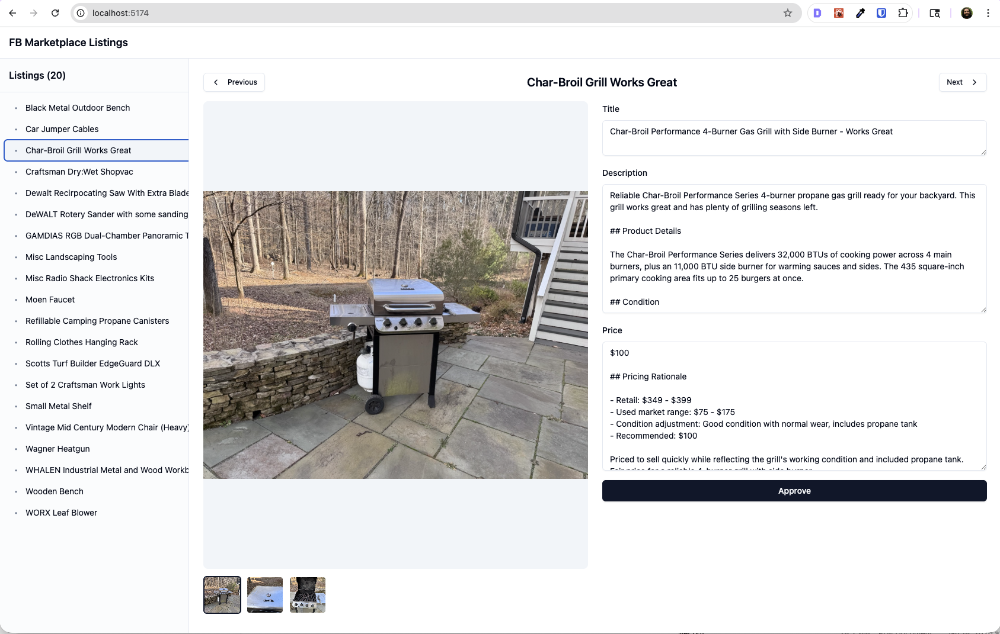

# FB Marketplace Listings Manager

A web application for managing Facebook Marketplace listings at scale. Edit product details, preview media, approve listings, and export to Facebook's bulk upload format.



## Features

- **Three-panel interface**: Browse listings in sidebar, preview images/videos, edit details
- **Auto-save**: Changes save automatically with debounced updates
- **Approval workflow**: Mark listings as approved before bulk export
- **Media support**: Images (JPEG, PNG, GIF, WebP) and videos (MP4, MOV, WebM)
- **AI-powered listing generation**: Claude skills for researching products and writing descriptions
- **Bulk export**: Export approved listings to Facebook Marketplace template format

## Quick Start

```bash
# Install dependencies
cd app && npm install

# Start development servers (client + API)
npm run dev
```

The app runs at http://localhost:5173 with the API at http://localhost:3001.

## Project Structure

```
fb-marketplace/
├── app/                    # Web application (React + Express)
│   ├── src/
│   │   ├── components/     # React components
│   │   │   ├── Sidebar.tsx     # Listing navigation panel
│   │   │   ├── MediaViewer.tsx # Image/video preview with thumbnails
│   │   │   ├── Editor.tsx      # Title/description/price editor
│   │   │   └── ui/             # shadcn/ui components (button, textarea, etc.)
│   │   ├── lib/
│   │   │   └── api.ts      # API client functions
│   │   ├── hooks/
│   │   │   └── useDebounce.ts  # Debounce hook for auto-save
│   │   ├── App.tsx         # Main app component
│   │   └── types.ts        # TypeScript interfaces
│   └── server/
│       └── index.ts        # Express API server
├── listings/               # Product listing folders (gitignored)
├── inbox/                  # Drop images here for processing
├── scripts/                # Shell scripts for automation
├── templates/              # Export templates
└── .claude/                # Claude Code skills and commands
```

### Listing Folder Structure

Each product gets its own folder under `listings/`. The folder name becomes the listing identifier in the app.

```
listings/
└── Dewalt Reciprocating Saw/
    ├── IMG_001.jpeg        # Product photos (required)
    ├── IMG_002.jpeg        # Multiple images supported
    ├── title.md            # Listing title (max 100 chars)
    ├── description.md      # Full product description
    ├── price.md            # Price with rationale
    └── approved.md         # Present = ready for export
```

| File | Purpose | Required |
|------|---------|----------|
| `*.jpeg/png/gif/webp` | Product images | Yes (at least one) |
| `*.mp4/mov/webm` | Product videos | No |
| `title.md` | Short, searchable title | Yes |
| `description.md` | Detailed description with specs | Yes |
| `price.md` | Price and pricing notes | Yes |
| `approved.md` | Approval marker (content ignored) | No |
| `listing.md` | Optional seller notes for AI | No |

The `approved.md` file acts as a flag. Its presence marks the listing as approved; the actual content is ignored. The app creates/deletes this file when you toggle approval.

## The Flow

| Step | Action | Type |
|------|--------|------|
| 1 | Drop images into `./inbox/` | Manual |
| 2 | `./scripts/process-inbox.sh` | Script |
| 3 | Verify listings look right | Manual |
| 4 | `./scripts/generate-all-listings.sh` | Script |
| 5 | Edit descriptions and prices in web app | Manual |
| 6 | Approve listings | Manual |
| 7 | `./scripts/export-template.sh` | Script |

### 1. Drop Images

Add product photos to the `inbox/` folder.

### 2. Process Inbox

```bash
./scripts/process-inbox.sh
```

Organizes images into listing folders under `listings/`.

### 3. Verify Listings

Check that the listing folders were created correctly and images are in the right places.

### 4. Generate Listings

```bash
./scripts/generate-all-listings.sh
```

Analyzes images, researches products, and generates title.md, description.md, and price.md files.

### 5. Edit in Web App

```bash
cd app && npm run dev
```

Refine titles, descriptions, and prices using the three-panel interface.

### 6. Approve Listings

Click "Approve" in the editor for listings ready to publish.

### 7. Export Template

```bash
./scripts/export-template.sh
```

Exports approved listings to Facebook Marketplace bulk upload format.

## Scripts

| Script | Purpose |
|--------|---------|
| `process-inbox.sh` | Organize inbox images into listing folders |
| `generate-all-listings.sh` | Research products and generate listing content |
| `export-template.sh` | Export approved listings to FB bulk upload template |

## Tech Stack

- **Frontend**: React 19, TypeScript, Vite, Tailwind CSS, shadcn/ui
- **Backend**: Express 5, Node.js
- **AI Integration**: Claude Code skills for product research and listing generation

## Development

```bash
cd app

# Run client only
npm run dev:client

# Run server only
npm run dev:server

# Build for production
npm run build

# Lint code
npm run lint
```

## License

MIT License - see [LICENSE](LICENSE) for details.
